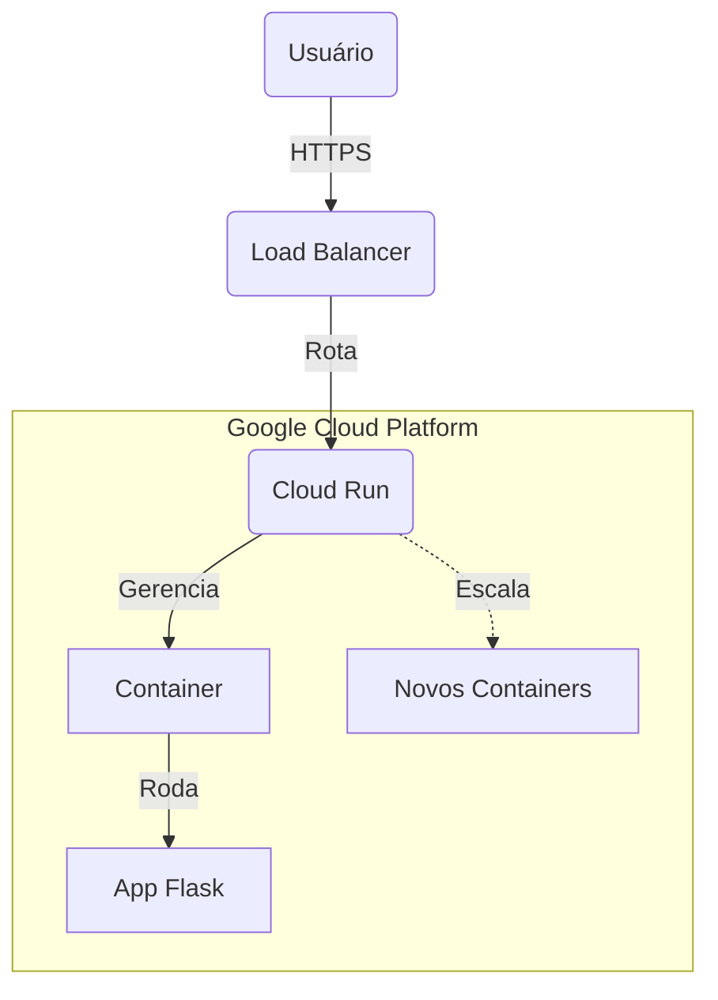

# 📘 Manual do Aluno: Engenharia de Software e Cloud Deploy
**Projeto:** API de Saudação Escalável (Serverless)
**Instrutor:** Daniel Cloud
**Data:** 09/12/2025

---

## 1. Visão Geral e Arquitetura

Neste laboratório, não vamos apenas "colocar um site no ar". Vamos simular o ciclo de vida de uma aplicação real de engenharia de software, partindo dos requisitos, passando pelo desenvolvimento e testes locais, até o deploy em uma infraestrutura de nuvem escalável.

### 1.1 Diagrama de Arquitetura (GCP)

A solução utiliza uma arquitetura **Serverless** baseada em Containers. Isso significa que não gerenciamos servidores (S.O., patches de segurança), apenas o código empacotado.



### 1.2 Tecnologias Adotadas

| Tecnologia | Função | Justificativa Técnica |
| :--- | :--- | :--- |
| **Python 3.11** | Linguagem | Alta legibilidade e vasto ecossistema de IA/Web. |
| **Flask** | Framework Web | Microframework leve, ideal para microsserviços simples. |
| **Gunicorn** | WSGI Server | Servidor de produção robusto (o servidor embutido do Flask não escala). |
| **Google Cloud Run** | Hospedagem | Computação serverless. Escala a zero (custo zero quando ocioso). |
| **Git & GitHub** | Versionamento | Padrão de mercado para controle de versão e colaboração. |

---

## 2. Engenharia de Requisitos

Antes de codificar, definimos o que o sistema deve ser.

### 2.1 Requisitos Funcionais (RF)
*O que o sistema faz.*

*   **RF01 - Saudação Pública:** O sistema deve expor um endpoint raiz (`GET /`) que retorne uma mensagem de boas-vindas e o timestamp atual do servidor.
*   **RF02 - Formato de Resposta:** Todas as respostas devem estar estritamente no formato **JSON** (`application/json`).
*   **RF03 - Health Check:** (Opcional) O sistema deve responder a requisições de monitoramento para indicar que está online.
*   **RF04 - Simulação de Geração de Conteúdo AI:** O sistema deve ter um endpoint (`POST /ia/gerar`) que simule a geração de conteúdo usando um modelo Gemini-Pro, recebendo um `prompt` e retornando um texto simulado.

### 2.2 Requisitos Não-Funcionais (RNF)
*Como o sistema se comporta.*

*   **RNF01 - Escalabilidade Elástica:** O sistema deve escalar automaticamente de 0 para N instâncias dependendo do tráfego.
*   **RNF02 - Custo Ocioso:** O custo deve ser zero quando não houver requisições (Scale to Zero).
*   **RNF03 - Portabilidade:** A aplicação deve ser independente de infraestrutura local, rodando em containers.
*   **RNF04 - Facilidade de Experimentação AI:** O código deve incluir um exemplo comentado de como integrar o SDK real do Google Generative AI.

### 2.3 Casos de Uso e Testes

| ID | Cenário | Entrada | Resultado Esperado |
| :--- | :--- | :--- | :--- |
| **CT01** | Acesso Raiz | `GET /` | Status 200 OK + JSON com chaves `mensagem`, `status`, `tecnologia`, `data_hora`. |
| **CT02** | Rota Inexistente | `GET /banana` | Status 404 Not Found. |
| **CT03** | Status da IA | `GET /ia/status` | Status 200 OK + JSON com chaves `modelo`, `estado`, `latencia_ms`. |
| **CT04** | Geração AI Padrão | `POST /ia/gerar` (JSON vazio) | Status 200 OK + JSON com resposta simulada para prompt padrão. |
| **CT05** | Geração AI com Prompt | `POST /ia/gerar` (JSON com `{"prompt": "minha pergunta"}`) | Status 200 OK + JSON com resposta simulada para `minha pergunta`. |

---

## 3. Git e GitHub Essencial

### 3.1 Instalação e Downloads (Links Oficiais)

Antes de começar, garanta que você tem as ferramentas certas. Não confunda o **Git** (motor) com o **GitHub** (site).

*   **Git (Obrigatório):** É o sistema de linha de comando. Sem ele, nada funciona.
    *   📥 [Baixar Git para Windows/Mac/Linux](https://git-scm.com/downloads)
*   **GitHub CLI (`gh`) (Essencial):** Ferramenta oficial que simplifica o login no GitHub sem precisar de senhas complexas ou tokens.
    *   📥 [Baixar GitHub CLI](https://cli.github.com/)
*   **GitHub Desktop (Opcional):** Uma interface visual para quem prefere não usar o terminal o tempo todo.
    *   📥 [Baixar GitHub Desktop](https://desktop.github.com/)
*   **VS Code (Recomendado):** O editor de código que usaremos. Já vem com integração Git.
    *   📥 [Baixar VS Code](https://code.visualstudio.com/)

### 3.2 O Conceito (Sem "Tecnês")

Imagine que você está escrevendo um livro.
*   **Git:** É o sistema que salva o histórico de cada página que você escreve ("Capítulo 1 - versão final", "Capítulo 1 - revisão 2"). Ele permite que você "volte no tempo" se apagar algo sem querer. Isso roda **no seu computador**.
*   **GitHub:** É como o Google Drive para esse seu livro. É onde você guarda a cópia na nuvem para não perder se seu PC quebrar, e onde outras pessoas podem ler e sugerir correções.

### 3.2 Configuração Inicial (Faça uma única vez)

Antes de começar, precisamos conectar seu terminal à sua conta do GitHub. Faremos isso de forma simples usando o `gh` (GitHub CLI).

**Passo 1: Autenticar (O Pulo do Gato)**
No seu terminal (Git Bash ou VS Code), rode:

```bash
gh auth login
```

Use as setas do teclado para responder:
1.  **What account do you want to log into?** -> GitHub.com
2.  **What is your preferred protocol for Git operations?** -> HTTPS
3.  **Authenticate Git with your GitHub credentials?** -> Yes
4.  **How would you like to authenticate GitHub CLI?** -> Login with a web browser

*O terminal vai te dar um código (ex: `1234-ABCD`). Copie, aperte Enter, cole no site que abrir e autorize.*

**Passo 2: Identificação no Histórico**
Diga ao Git quem é você para os registros locais:

```bash
# Diga ao Git quem é você (Use o mesmo nome/email do seu GitHub)
git config --global user.name "Seu Nome Completo"
git config --global user.email "seu.email@exemplo.com"

# Define a branch principal como 'main' (padrão moderno)
git config --global init.defaultBranch main
```

### 3.4 O Fluxo de Trabalho (Workflow)

Este é o ciclo que você repetirá centenas de vezes. Decore-o!

#### Passo 1: Iniciar (Start)
Transforma uma pasta comum em um repositório Git.
```bash
cd projeto-aula-cloud
git init
```

#### Passo 2: O Palco (Staging)
O Git não salva tudo automaticamente. Você precisa escolher o que vai para a "foto" (commit).
```bash
# Adiciona um arquivo específico
git add main.py

# OU adiciona TUDO que mudou (mais comum)
git add .
```

#### Passo 3: O Click (Commit)
Aqui você tira a "foto" e salva no histórico.
```bash
git commit -m "Adiciona função de saudação da IA"
```
*Dica:* A mensagem entre aspas deve explicar **o que** você fez.

#### Passo 4: Enviar para Nuvem (Push)
Envia suas alterações locais para o GitHub.
```bash
# Na primeira vez, você conecta o repositório remoto:
git remote add origin https://github.com/SEU_USUARIO/NOME_DO_REPO.git

# Envia os arquivos
git push -u origin main
```

### 3.5 Branching: Universos Paralelos

Nunca mexa no código principal (`main`) diretamente se estiver testando algo arriscado. Crie um universo paralelo (`branch`).

```bash
# 1. Cria e entra numa nova branch chamada 'nova-feature-ia'
git checkout -b nova-feature-ia

# 2. ... (Você faz alterações, edita arquivos, quebra coisas) ...

# 3. Salva no seu universo paralelo
git add .
git commit -m "Testando novo modelo de IA"

# 4. Volta para o universo principal (main)
git checkout main
# (Note que seus arquivos voltaram a ser como eram antes!)

# 5. Traz as alterações da branch para a main (Merge)
git merge nova-feature-ia
```

### 3.6 Cheat Sheet (Resumão)

| Comando | O que faz? | Tradução Livre |
| :--- | :--- | :--- |
| `git status` | Mostra o estado atual | "O que eu mudei e não salvei?" |
| `git log` | Mostra o histórico | "Deixa eu ver minha linha do tempo." |
| `git clone <url>` | Baixa um projeto | "Baixar esse projeto para meu PC." |
| `git pull` | Atualiza seu PC | "Baixar as novidades da nuvem." |
| `git diff` | Mostra diferenças | "O que mudou exatamente neste arquivo?" |

---

## 4. Python Moderno: Ambientes Virtuais com UV

### 4.1 O Problema dos Ambientes
Imagine que você tem dois projetos:
*   **Projeto A:** Usa uma IA antiga que precisa do `pandas` versão 1.0.
*   **Projeto B:** Usa uma IA nova que precisa do `pandas` versão 2.0.

Se você instalar tudo no seu computador principal, um projeto vai quebrar o outro.
**Solução:** Criamos "caixas" isoladas para cada projeto. Chamamos isso de **Virtual Environment (venv)**.

### 4.2 Por que UV?
Antigamente, usávamos `pip` e `venv`. Era lento e confuso.
O **UV** é uma ferramenta moderna (escrita em Rust) que faz tudo isso instantaneamente.

**Instalação do UV:**
```bash
# Mac / Linux
curl -LsSf https://astral.sh/uv/install.sh | sh

# Windows (PowerShell)
powershell -c "irm https://astral.sh/uv/install.ps1 | iex"
```

### 4.3 Iniciando um Projeto

Esqueça `python -m venv ...`. Com UV é assim:

#### Passo 1: Inicializar
Na pasta do seu projeto:
```bash
uv init
```
Isso cria um arquivo `pyproject.toml`. Ele é a "receita do bolo" do seu projeto.

#### Passo 2: Criar o Ambiente Virtual
```bash
uv venv
```
Isso cria a pasta `.venv` (a caixa isolada). O UV baixa o Python automaticamente se precisar!

#### Passo 3: Adicionar Bibliotecas
Não use `pip install`. Use `uv add`. Ele atualiza sua receita (`pyproject.toml`) automaticamente.
```bash
uv add flask gunicorn
uv add google-generativeai # Para o Gemini
uv add pytest --dev        # Adiciona como dependência apenas de desenvolvimento/teste
uv add ruff --dev          # Para linting e formatação
```

### 4.4 Rodando seu Código

Para rodar o código usando as bibliotecas da "caixa" isolada, coloque `uv run` antes do comando.

```bash
# Rodar seu script
uv run main.py

# Rodar testes
uv run pytest
```

### 4.5 Resumo para a Aula

1.  Crie a pasta: `mkdir projeto-aula-cloud`
2.  Entre nela: `cd projeto-aula-cloud`
3.  Inicie o UV: `uv init`
4.  Instale Flask: `uv add flask` (e as outras bibliotecas)
5.  Crie seu código (`main.py`) na raiz.
6.  Rode: `uv run main.py`

Simples assim. Sem conflitos de versão, sem dor de cabeça.

---

## 5. Implementação, Testes e Deploy (O Ciclo de Vida do Projeto)

### 5.1 Preparação para o Deploy: Google Cloud (Sem Cartão de Crédito)
...
### 5.2 Estrutura do Projeto

Vamos organizar nosso código de forma profissional e simples.

```text
/projeto-aula-cloud/
├── pyproject.toml         # Configuração do UV e dependências
├── requirements.txt       # Gerado pelo UV para o Deploy (compatibilidade GCP)
├── main.py                # Nosso código da aplicação Flask (API)
├── index.html             # Frontend HTML (Página principal)
├── style.css              # Estilos CSS
├── script.js              # Lógica JavaScript
└── tests/
    └── test_main.py       # Testes automatizados para a aplicação
```

### 5.3 O Código Fonte da Aplicação (`main.py`)

Este é o coração da nossa API e agora também serve nosso frontend HTML.

```python
from flask import Flask, jsonify, request, send_from_directory # Importe send_from_directory
import os
import datetime

# Definimos onde estão os arquivos estáticos
STATIC_DIR = os.path.abspath(os.path.dirname(__file__))

app = Flask(__name__, static_folder=STATIC_DIR, static_url_path='') # Configura para servir da raiz

@app.route("/")
def serve_index():
    """
    Rota principal que serve o arquivo index.html.
    """
    return send_from_directory(STATIC_DIR, 'index.html')

# Rota para servir CSS, JS e outros arquivos estáticos diretamente da raiz
@app.route("/<path:filename>")
def serve_static(filename):
    """
    Serve arquivos estáticos (CSS, JS, etc.) diretamente da raiz.
    """
    # Evita que a Flask tente servir o index.html novamente para /
    if filename == 'index.html':
        return serve_index()
    return send_from_directory(STATIC_DIR, filename)

@app.route("/api/saudacao") # Rota da API renomeada para evitar conflito com '/'
def home():
    """
    Rota da API que retorna saudação e metadados.
    """
    return jsonify({
        "mensagem": "Olá, Turma de IA Aplicada! Este é o backend da sua API.",
        "status": "online",
        "tecnologia": "Python + Flask + Google Cloud Run",
        "data_hora": datetime.datetime.now().isoformat()
    })

@app.route("/ia/status")
def ia_status():
    """
    Simula um endpoint de verificação de um modelo de IA.
    """
    return jsonify({
        "modelo": "Gemini-Pro-Simulado",
        "estado": "pronto",
        "latencia_ms": 45
    })

@app.route("/ia/gerar", methods=["POST"])
def ia_gerar():
    """
    Endpoint que simula a interação com um modelo Gemini-Pro.
    Inclui um exemplo COMENTADO de como integrar o SDK real.
    """
    # Exemplo COMENTADO de como integrar com o Google Generative AI SDK
    # Para usar, você precisaria instalar a biblioteca:
    # uv add google-generativeai
    #
    # e configurar sua API Key (NÃO coloque a chave aqui diretamente! Use variáveis de ambiente):
    # import google.generativeai as genai
    # try:
    #     genai.configure(api_key=os.environ.get("GENAI_API_KEY"))
    #     model = genai.GenerativeModel('gemini-pro')
    #     
    #     prompt = request.json.get("prompt", "Gere um breve parágrafo sobre a importância da IA na educação.")
    #     response = model.generate_content(prompt)
    #     
    #     return jsonify({
    #         "resultado": response.text,
    #         "modelo": "Gemini-Pro-REAL",
    #         "status": "sucesso"
    #     }), 200
    # except Exception as e:
    #     return jsonify({
    #         "erro": str(e),
    #         "modelo": "Gemini-Pro-REAL",
    #         "status": "falha",
    #         "detalhes": "Certifique-se de que GENAI_API_KEY está configurada e o modelo está disponível."
    #     }), 500

    # Simulação para a aula:
    data = request.get_json()
    prompt = data.get("prompt", "Gere um breve parágrafo sobre a importância da IA na educação.")
    simulated_response = f"Simulação de resposta do Gemini para: '{prompt}'. A IA está revolucionando a educação, personalizando o aprendizado e otimizando processos."
    
    return jsonify({
        "resultado": simulated_response,
        "modelo": "Gemini-Pro-Simulado",
        "status": "sucesso",
        "nota": "Descomente o código acima e configure sua GENAI_API_KEY para usar o Gemini real!"
    }), 200

def create_app():
    return app

if __name__ == "__main__":
    # Pega a porta do ambiente (obrigatório para Cloud Run)
    port = int(os.environ.get("PORT", 8080))
    app.run(host="0.0.0.0", port=port, debug=True)
```

### 5.4 Definição de Dependências (`requirements.txt`)

Este arquivo é gerado pelo UV e é essencial para que o Google Cloud entenda quais bibliotecas instalar para a sua aplicação.

```text
Flask==3.0.0
gunicorn==21.2.0
google-generativeai==0.3.1 # Para quem for testar o Gemini real (descomentado no main.py)
werkzeug==3.0.1
```

### 5.5 Garantia de Qualidade (Testes Automatizados - `tests/test_main.py`)

Testes são a rede de segurança do seu código. Eles verificam se tudo funciona como esperado antes de ir para a nuvem.

```python
import pytest
from main import create_app # Importe direto do arquivo main.py na raiz
import json

@pytest.fixture
def client():
    app = create_app()
    app.config['TESTING'] = True
    with app.test_client() as client:
        yield client

def test_root_serves_html(client):
    """Testa se a rota raiz (/) serve o index.html com o conteúdo esperado."""
    response = client.get('/')
    assert response.status_code == 200
    assert b"<h1>Ol\xc3\xa1, Mundo!</h1>" in response.data # Verifica o título no HTML
    assert b'<a href="https://iaforte.com.br" target="_blank">IA Forte</a>' in response.data


def test_api_saudacao_status_code(client):
    """Testa se a rota /api/saudacao responde com sucesso (200)"""
    response = client.get('/api/saudacao')
    assert response.status_code == 200

def test_api_saudacao_json_structure(client):
    """Testa se a rota /api/saudacao retorna um JSON válido e tem as chaves certas"""
    response = client.get('/api/saudacao')
    dados = response.get_json()
    
    assert "mensagem" in dados
    assert "tecnologia" in dados
    assert dados["status"] == "online"
    assert "data_hora" in dados

def test_ia_status_endpoint(client):
    """Testa a rota /ia/status"""
    response = client.get('/ia/status')
    dados = response.get_json()
    assert response.status_code == 200
    assert dados["modelo"] == "Gemini-Pro-Simulado"
    assert dados["estado"] == "pronto"

def test_ia_gerar_endpoint_default(client):
    """Testa a rota /ia/gerar com prompt padrão"""
    response = client.post(
        '/ia/gerar',
        data=json.dumps({}),
        content_type='application/json'
    )
    dados = response.get_json()
    assert response.status_code == 200
    assert "Simulação de resposta do Gemini para: 'Gere um breve parágrafo sobre a importância da IA na educação.'" in dados["resultado"]
    assert dados["modelo"] == "Gemini-Pro-Simulado"

def test_ia_gerar_endpoint_custom_prompt(client):
    """Testa a rota /ia/gerar com prompt personalizado"""
    custom_prompt = "Explique a computação em nuvem de forma simples."
    response = client.post(
        '/ia/gerar',
        data=json.dumps({"prompt": custom_prompt}),
        content_type='application/json'
    )
    dados = response.get_json()
    assert response.status_code == 200
    assert f"Simulação de resposta do Gemini para: '{custom_prompt}'" in dados["resultado"]
    assert dados["modelo"] == "Gemini-Pro-Simulado"
```
*(Nota: O código completo dos testes continua verificando as rotas da mesma forma)*

### 5.6 O Ciclo D.T.D. (Desenvolver, Testar, Deploy)

Não escrevemos código direto na produção. Seguimos um ritual para garantir qualidade.

#### FASE 1: Desenvolvimento (Local) 🏠
É onde você cria. Seu laboratório pessoal.
*   **Onde:** No VS Code, rodando com `uv`.
*   **Comando:** `uv run main.py`
*   **Status:** "Funciona na minha máquina".

#### FASE 2: Verificação (Testes) 🕵️
Antes de mostrar para o mundo, verificamos se não há erros óbvios.
*   **Testes Automatizados:** O computador testa seu código por você.
*   **Linting:** O computador verifica se seu código está "bonito" e organizado.
*   **Comando:**
    ```bash
    uv run ruff check .  # Verifica estilo
    uv run pytest        # Roda os testes lógicos
    ```

#### FASE 3: Deploy (Nuvem) ☁️
O momento da verdade. Enviamos para o Google Cloud.

*   **Onde:** No **Google Cloud Shell** (disponível no Google Cloud Skills Boost ou no console GCP).
*   **Requisito:** O projeto deve ter um arquivo `requirements.txt` (O Google Cloud ainda não usa `uv` nativamente por padrão em todos os builders, então geramos um para compatibilidade).

**Passo 0: Configurar o Projeto (Evite erros de permissão!)**
Antes de fazer o deploy, garanta que o terminal sabe onde guardar seu site.

> **⚠️ ATENÇÃO:**
> *   **Se você está no Skills Boost:** NÃO crie um projeto novo! O laboratório já te dá um projeto pronto (com ID tipo `qwiklabs-gcp-...`). Use esse ID no comando de seleção abaixo. O faturamento já está pago pelo Google.
> *   **Se você está na sua conta pessoal:** Você precisará ativar o "Faturamento" (Billing) no console do Google Cloud adicionando um cartão de crédito, senão os serviços não ativarão.

1.  **Crie um projeto (APENAS se estiver na conta pessoal e não tiver um):**
    ```bash
    # O ID do projeto deve ser único no mundo todo!
    gcloud projects create projeto-aula-cloud-SEUNOME
    ```
    *(Substitua `SEUNOME` por algo único, ex: `projeto-aula-cloud-daniel`)*

2.  **Selecione o projeto:**
    ```bash
    # No Skills Boost, pegue o ID do projeto na lateral esquerda da tela do laboratório
    gcloud config set project ID_DO_PROJETO_AQUI
    ```

**Passo 1: Preparar Dependências**
Exportando dependências do UV para o padrão antigo:
```bash
uv pip compile pyproject.toml -o requirements.txt
```

**Passo 2: Enviar para o Google**
(dentro do Cloud Shell):
```bash
gcloud run deploy projeto-aula-cloud --source . --allow-unauthenticated
```

#### Check-list Final do Deploy

- [ ] Código rodando local com `uv run`.
- [ ] Testes passando (`pytest` verde).
- [ ] Código salvo no GitHub (`git push`).
- [ ] `requirements.txt` gerado.
- [ ] `gcloud run deploy` executado com sucesso.
- [ ] URL pública acessada pelo celular! 📱

---

## 6. Métricas e Observabilidade

Após o deploy, a engenharia não acaba. Precisamos monitorar. No console do Google Cloud (aba **Métricas** do Cloud Run), observe:

1.  **Request Count:** Quantas pessoas acessaram.
2.  **Container Instance Count:**
    *   Se ninguém acessar por 15min, deve ir a **0** (Custo Zero).
    *   Se 1000 pessoas acessarem, deve subir para **N** containers automaticamente.
3.  **Billable Instance Time:** O tempo real pelo qual você será cobrado (ou descontado da cota gratuita).

---

## 7. Desafio Extra (Para casa)

Tente alterar o `main.py` para receber um parâmetro na URL, por exemplo `/saudacao/Daniel`, e retornar `{"message": "Olá, Daniel"}`.
*Dica: Pesquise por "Flask Dynamic Routing".*

Outro desafio: Descomente o código do Gemini na rota `/ia/gerar` do `src/main.py`, obtenha uma API Key do Google AI Studio e faça sua API interagir com o Gemini de verdade!